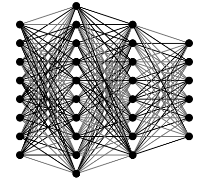
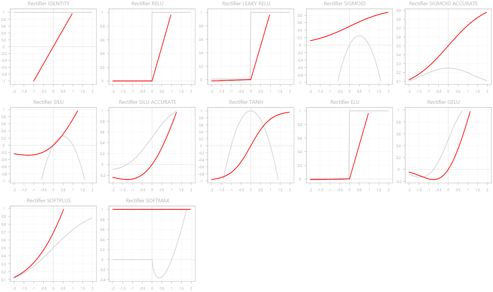
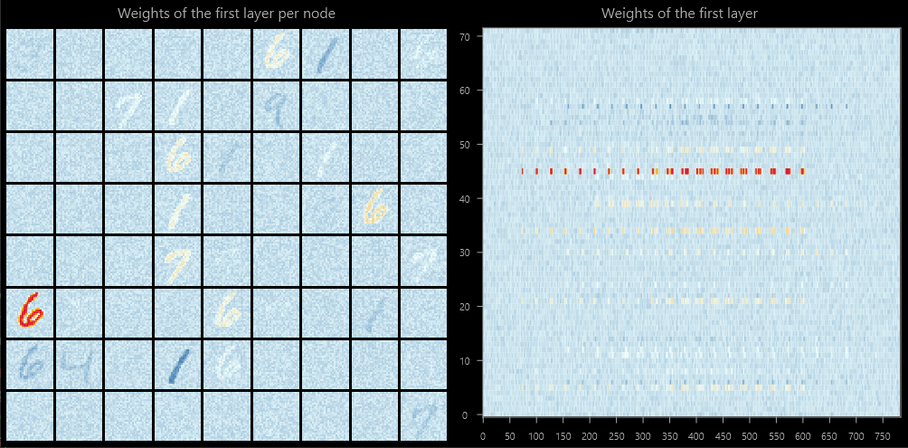
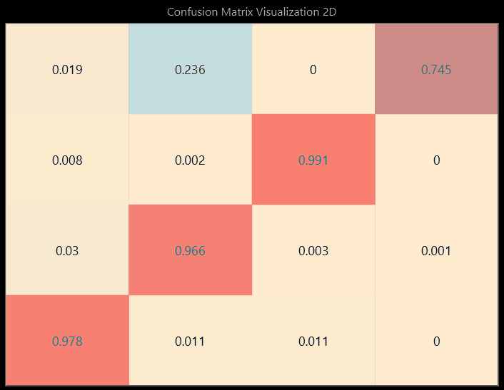

# neural network library
This is a maven library for neural networks in java 8.  
Different visualization options are provided with javafx.  

  

## Table of Contents
1. [About](#about)
2. [Scope](#scope)  
    2.1 [Architecture](#architecture)  
    2.2 [Supported algorithms](#supported-algorithms)  
    2.3 [Rectifiers](#rectifiers)  
    2.4 [Optimizers](#learning-and-mutation-rate-optimizer)  
    2.5 [Parametrization](#parametrization)  
    2.6 [Persistence](#persistence)  
    2.7 [UI](#ui)  
3. [Samples](#samples)  
   3.1 [Overview](#overview)   
   3.2 [Walkthrough](#walkthrough)
4. [Implementation](#implementation)  
5. [Releases](#releases)
6. [References](#references)

## About
The motivation for this library originated in the study project [snakeML](https://github.com/lpapailiou/SnakeML),
where the game snake was to be solved by neural networks. The rudimentary approach was extracted to this library
and improved over time to study both neural networks and play around with java.  
The goal of this library is to make neural networks easily accessible in terms of 'how does it work' and to
provide an easy-to-use and plug-and-play-tool for other projects.  
While the first steps focused on functionality, later work focused on different approaches of visualization with javafx.

## Scope
### Architecture
- fully connected
- none to many hidden layers supported
- node count per layer is configurable

### Supported algorithms
- Supervised learning
- Genetic algorithm

### Rectifiers
Implemented are following rectifiers:
- Identity
- RELU
- Leaky RELU
- Sigmoid
- Sigmoid (accurate)
- SILU
- SILU (accurate)
- TANH
- ELU
- GELU
- Softplus
- Softmax

### Learning and mutation rate optimizer
- none (static learning rate)
- stochastic gradient descent

### Parametrization
The parametrization of the hyperparameters of the neural network can be done as following:
- programmatically
- by `neuralnetwork.properties` in case default values are used constantly

### Persistence
- neural network instances are fully serializable

### UI
With the additional ui package, you may be able to visualize the neural network and additional metrics interactively based on the ``javafx`` framework.
  
## Samples
### Overview
In order to have an idea about the look and feel, see following samples.  

Sample code for a minimal prediction task:

    double[] in = {1,0.5};                                              // input values
    NeuralNetwork neuralNetwork = new NeuralNetwork.Builder(2, 4, 1)
        .setDefaultRectifier(Rectifier.SIGMOID)
        .setLearningRate(0.8)
        .build();                                                       // initialization
    List<Double> out = neuralNetwork.predict(in);                       // prediction

Live visualization of a predicting neural network:   

Line charts of available rectifiers:  

Visualization of weights of a layer per node and overall, trained on mnist:    

Confusion matrix visualization:  

Binary decision boundaries in 2D and 3D, manually refreshed while training:

Multiclass decision boundaries in 3D, animated:

### Walkthrough
Detailed examples are available here:

| Topic 	| Description 	| 
|-----	|---------	|
| Link    	| Description        	|
| Link    	| Description        	|

## Implementation
This library can be either implemented by jar file or as maven dependency.  
Detailed instructions are documented [here](doc/implementation.md).

## Releases
As this project started 'fun project' and the concept of 'free time' is more a fairy tale than reality, 
there is not a proper version control (yet).  
In general, the neural netowrk algorithm is quite stable, no big changes are to be expected soon.  
Before new features are introduced, a stable, consistent realease will be made.

| Release 	| Description 	| 
|-----	|---------	|
| upcoming   	| stable, consistent release, focusing on consistency        	|
| [3.1](https://github.com/lpapailiou/neuralnetwork/releases/latest)   	| mostly minor fixes and features added, currently treated as snapshot        	|
| 3.0    	| introduction of charts and other visualizations, lot of refactoring        	|
| <= 2.5    | multiple releases focusing on the neural network algorithm        	|

## References
- [GitHub Repository JavaNet by Suyash Sonowae](https://github.com/SuyashSonawane/JavaNet)
- [Hansen, Casper: Activation Functions Explained - GELU, SELU, ELU, ReLU and more. Deep Learning, mlfromscratch, 22.08.2019](https://mlfromscratch.com/activation-functions-explained/#/)
- [Karpathy, Andrej: CS231n Winter 2016, Stanford Lectures, Youtube](https://www.youtube.com/watch?v=NfnWJUyUJYU&list=PLkt2uSq6rBVctENoVBg1TpCC7OQi31AlC)
- [Hansen, Casper: Neural Networks: Feedforward and Backpropagation Explained & Optimization. Deep Learning, mlfromscratch, 5.08.2019](https://mlfromscratch.com/activation-functions-explained/#/)
- [Bialas, Piotr: Implementation of artifical intelligence in Snake game using genetic algorithm and neural networks, CEUR 2468, 2019](http://ceur-ws.org/Vol-2468/p9.pdf)
- Steinwendner, Joachim et. al: Neuronale Netzw programmieren mit Python. 2. Auflage, Rheinwerk Verlag, 2020, 978-3-8362-7450-0.
- Chollet, Francois: Deepl Learning mit Python und Kears. Das Praxis-Handbuch. mitp Verlags GmbH & Co. KG, Frechen, 2018, 978-3-95845-838-3.
- Geron, Aurelien: Hands.On Machine Learning with Scikit-Learn, Keras & TensorFlow. Concepts, Tools, and Techniques to Build Intelligent Systems. Second Edition, O'Reilly, Canada 2019, 978-1-492-03264-9
- Lapan, Maxim: Deep Reinforcement Learning Hands-On. Second Edition, Packt Publishing, Birmingham, 2020, 978-1-83882-699-4
- Last but not least, for reasons: [https://stackoverflow.com/](https://stackoverflow.com/)