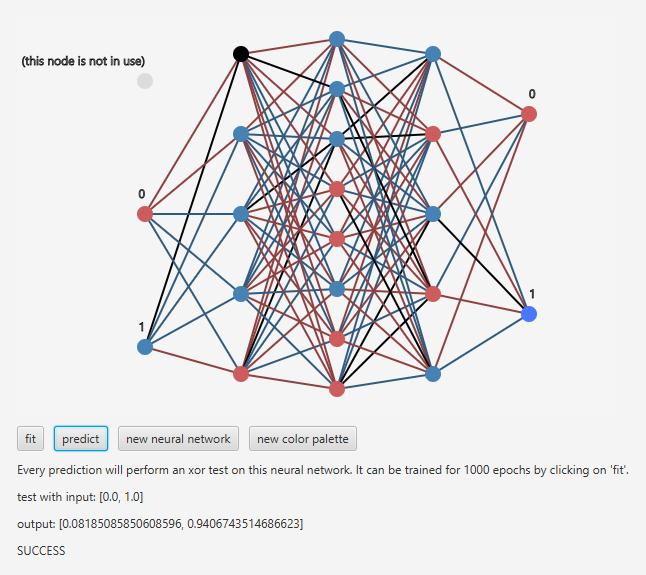

# walkthrough: visualization
charts, decision boundaries, confusion matrix, layer weights etc. in 2D and 3D

## Table of Contents
1. [Concept](#concept)  
2. [Graph](#graph)
3. [Visualizations](#visualizations)  
   3.1 [General](#general)
   3.2 [Scatter charts](#scatter-charts)  
   3.3 [Line charts](#line-charts)  
   3.4 [Layer weights](#layer-weights)  
   3.5 [Decision boundaries](#decision-boundaries)  
4. [Samples](#samples)

## Concept
There are two basic visualization techniques: graphs and plots. The graph represents the neural network architecture
with nodes and edges, while the plots combine multiple subtypes as scatter and line charts as well as grid visualizations. 
Plots are available in 2d and 3d each.  

    + graph
    + plot
        + 2D
        + 3D

## Graph
With the package `ui` you will get access to the neural network graph. It uses the javafx framework.

It will build a graph of a specific neural network and is able to visualize its architecture, weight distribution and current
node values. See here an example (code is available in the `test/java/ui` directory):

The graph can be initialized with an available GraphicsContext object only. At this point, no neural network is available yet
for display, so no graph will appear so far.

    NNGraph graph = new NNGraph(context);

As soon as the object is created, the neural network can be set. As the graph sets a property change listener to the neural
network, it will react automatically as soon as a prediction was made.

    NeuralNetwork neuralNetwork = new NeuralNetwork.Builder(2, 3, 2).build();
    graph.setNeuralNetwork(neuralNetwork);                   // at this point, the graph becomes visible
    
    neuralNetwork.predict(new double[]{1, 0});               // at this point, the graph will react

If you like to change the colors, you can do so by setting a custom color palette.

    NNGraphColor colors = new NNGraphColor(    
        WHITESMOKE,                                 // background color
        BLACK,                                      // node color
        BLACK,                                      // line color
        ROYALBLUE.brighter(),                       // flashed node color (max. output value)
        GAINSBORO,                                  // inactive input node color
        STEELBLUE,                                  // upper value node color
        INDIANRED,                                  // lower value node color
        STEELBLUE.darker(),                         // upper value weight color
        INDIANRED.darker());                        // lower value weight color
        
    graph.setColorPalette(colors);

The thresholds for the color switch between negative / neutral / positive may be changed individually for nodes and weights.

    double lowerBound = 0.3;
    double upperBound = 0.7;
    
    graph.setNodeColorThreshold(lowerBound, upperBound);
    graph.setWeightColorThreshold(lowerBound, upperBound);

Further parametrization possibilities are listed below:

    graph.setPadding(0, 0, 0, 20);                     // top, right, bottom, left
    graph.setDynamicGrowth(true);                      // graph will get larger horizontally with more layers
    graph.setInputNodeLabels(new String[]{"a", "b"});
    graph.setOutputNodeLabels(new String[]{"0", "1"});
    graph.setNodeRadius(7.0);
    graph.setLineWidth(2.0);
    graph.setFontProperties(false, false, 12);         // parameters for bold, italic, fontsize (default settings)

There is also the edge case covered where your neural network has less input nodes than you want to display.
Now, you can pretend there would be more input nodes and just add them graphically. You need to set the
total count of input nodes the graph should have and list the indexes of the input nodes which should appear as inactive.

    int totalNodes = 3;
    Set<Integer> inactiveIndexes = new HashSet();
    inactiveIndexes.addAll(0,1);
    graph.setGraphInputNodeCount(totalNodes, inactiveIndexes);

More visualization possibilities will come in 2d and 3d, focusing on visualization and monitoring of the neural network performance.  

